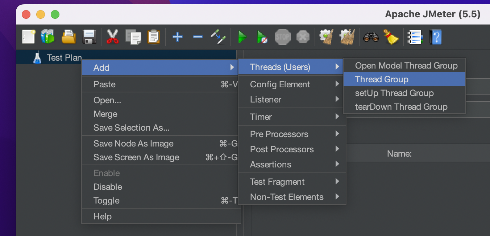
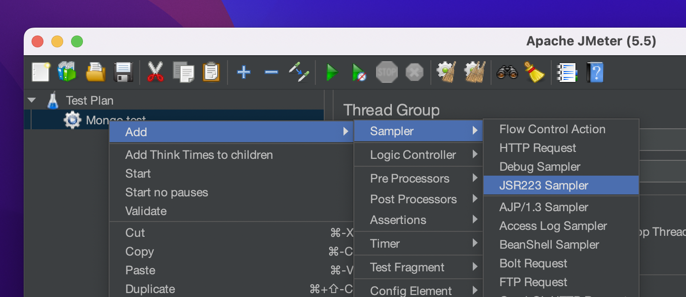
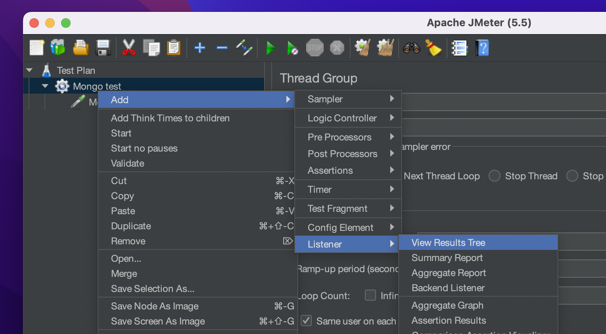
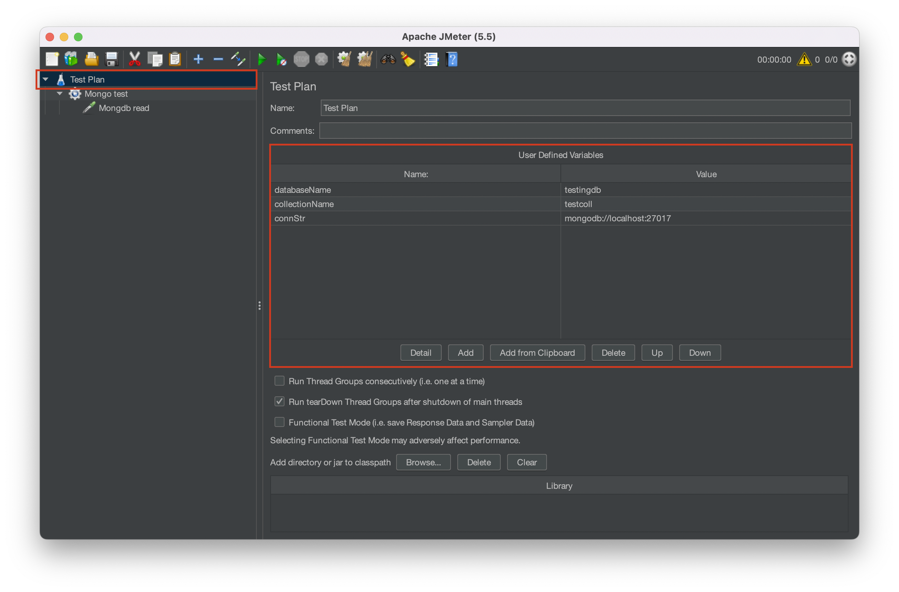

# Mongodb Jmeter Testing

## Instructions

### Step 1 - Install Jmeter

- Download Java JDK (openJDK 11 is perferred) from [here](https://adoptium.net/temurin/releases)
- Download Apache Jmeter form [here](https://jmeter.apache.org/
download_jmeter.cgi)
- Extract Jmeter in some folder
- Download BSON jar file from [here](https://repo1.maven.org/maven2/org/mongodb/bson/4.6.1/bson-4.6.1.jar)
- Download mongodb-java-driver jar file from [here](https://repo1.maven.org/maven2/org/mongodb/mongo-java-driver/3.12.11/mongo-java-driver-3.12.11.jar)

### Step 2 - Patching Jmeter

As the Jmeter application comes with older version of mongodb driver we have to patch them manually

- Extract and copy both BSON and mongodb-java-driver jar file
- paste it in `jmeter/lib/`
- Now delete the older version of mongodb-java-driver present in `lib` folder

### Step 3 - Start Jmeter

- For Windows, Start the Jmeter application by naviating to `jmeter/bin` and double clicking on `jmeter.bat` file.
- For Linux/Mac, Start the app by double clicking on `jmeter.sh` file or running `sh jmeter/bin/jmeter.sh` command.
- Now you will be presented with the jmeter window
- Create a new Thread group, rename it

- Create a new JSR223 Sampler, rename it to mongoDB_read

- Paste the `scripts/mongodb_read.jmx` code into the big script text area
- Create another JSR223 sampler and rename it to mongoDB_write
- Paste the `scripts/mongodb_write.jmx` code into the big script text area
- Add listeners to thread group based on your needs

### Step 4 - Connect DB

- Create a new db in local mongodb instance or mongodb atlas
- get the database connection string
- get the database name
- get the collection name to work with
- add all the details to the Test plan use defined variables section

### Step 5 - Run Profiling

- Click on green run button on top bar of Jmeter to start testing
- View results on one of the listeners
